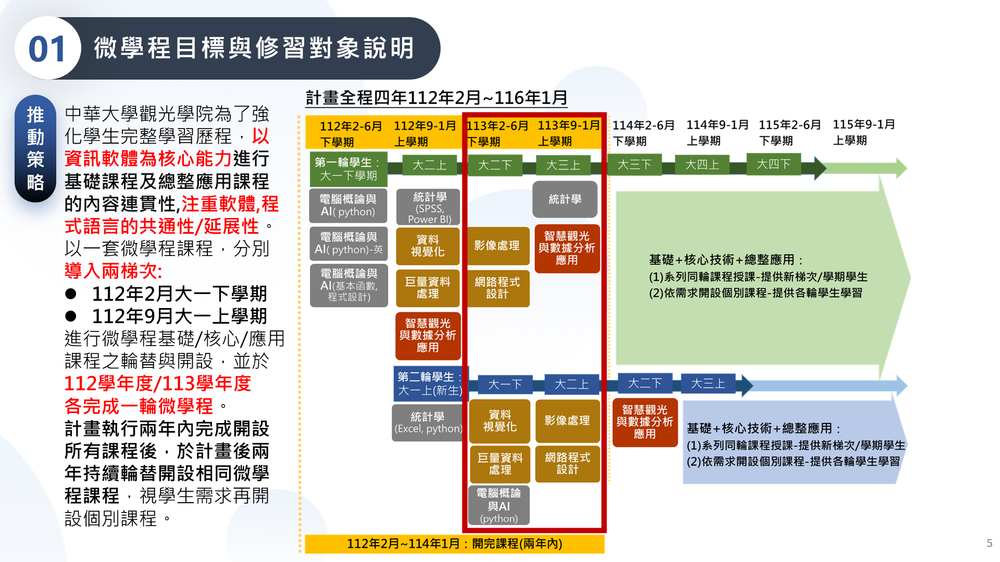
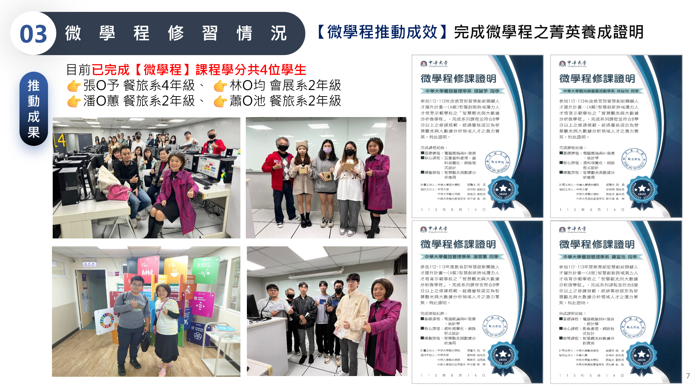
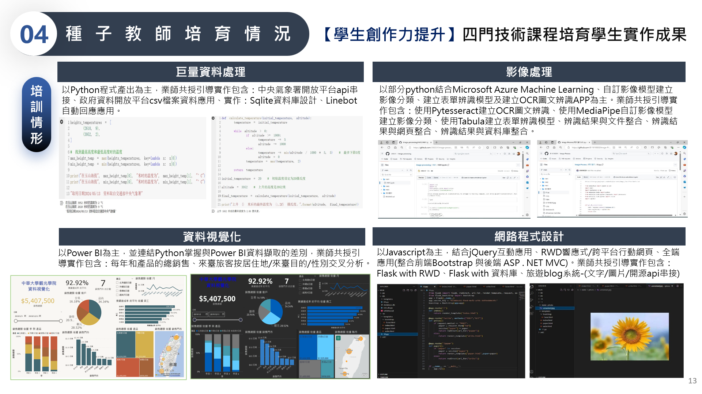
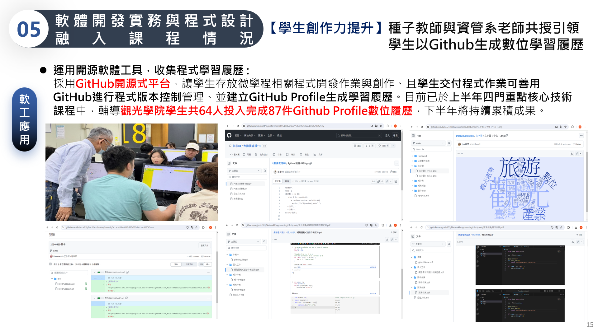

# 114 教育部智慧創新關鍵人才躍升計畫
<a href="http://140.126.146.12:9090/GitHub2023/">114 教育部智慧創新之 GitHub 學習平台</a>&nbsp;<a
href="https://chat.openai.com/auth/login">技術諮詢</a>
<table>
 <tr>
 <th>系級</th>
 <th></th>
 <th><a href="">學習履歷</a></th>
 <th><a href="https://chat.openai.com/">好友</a></th>
 </tr>
 <tr>
 <td><a href="https://hm.chu.edu.tw/index.php?Lang=zh-tw">餐旅系</a></td>
 <td><a href="https://www.youtube.com/watch?v=dK9rBfbUETw">看我</a></td>
 <td><a href="">巨量資料處理</a></td>
 <td>高 O 諺</td>
 </tr>
 <tr>
 <td><a href="https://bdct.chu.edu.tw">觀光學院學士班</a></td>
 <td><a href="https://bdct.chu.edu.tw/p/412-1092-2946.php?Lang=zh-tw">實習</a></td>
 <td><a href="">資料視覺化</a></td>
 <td>張 O 庭</td>
 </tr>

 <tr>
 <td><a href="https://mice.chu.edu.tw/index.php?Lang=zh-tw">會展系</a></td>
 <td><a href="https://mice.chu.edu.tw/p/412-1041-112.php?Lang=zh-tw">海外移地教學</a></td>
 <td><a href="https://github.com/simondeng777/ImageProcessing">影像處理</a></td>
 <td>郭 O 瑄</td>
 </tr>
</table> 
</img>
</img>
</img>
</img>
